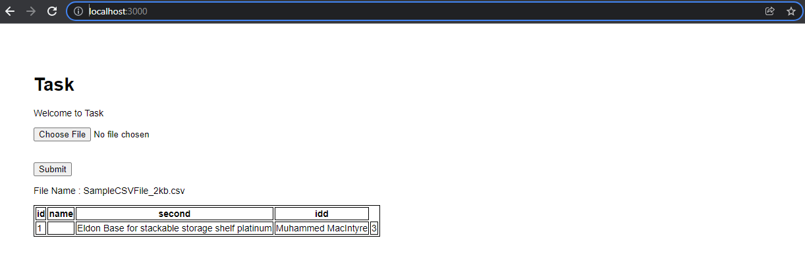

# Fluxestem Task

### How to run

Run the following commands

1.  `git clone `
2.  `npm i`
3.  `npx sequelize db:create`
4.  `npx sequelize db:migrate`
5.  `npm run dev`

Database Structure:

1. File Name table will store files name.
2. Flie heading will store file headings with one to many relationship file heading.
3. file column table will store the each column information with one to many relationship with one to many columns

### Screenshot

